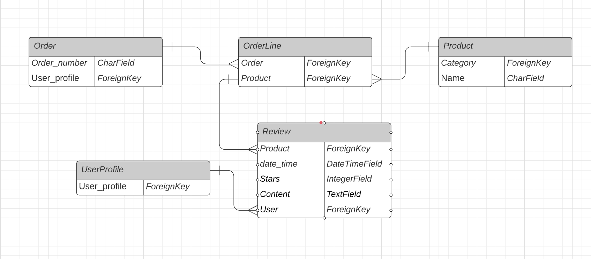

<p id="top"></p>

# Gstore
## Code Institute: Milestone Project 4 - Nguyen Truong Thai Long

[View live deployment of site here](https://gstore-ms4.herokuapp.com/)

Gstore is an E-Commerce website for graphic designs. Gstore with an outstanding and stylish layouts with clear and concise messaging and effective use of white space have a higher chance of capturing the viewer’s eye and resonate users.

# Table of Contents

- [Project Requirements](#project-requirements)
    - [Mandatory Requirements](#mandatory-requirements)
- [UX](#ux)
    - [UX Design](#ux-design)
    - [User Stories](#user-stories)
    - [Wireframes](#wireframes)
    - [Database Schema](#database-schema)
- [Features](#features)
    - [Home page](#home-page)
    - [User account](#user-account)
    - [Shopping Bag](#shopping-bag)
    - [Search bar](#search-bar)
    - [Check out](#check-out)
    - [Administrator features](#administrator-features)
- [Technologies Used](#technologies-used)
    - [Languages](#languages)
    - [Tools and Libraries](#tools-and-libraries)
- [Testing](#testing)
- [Deployment](#deployment)
    - [Deployment to Heroku](#deployment-to-heroku)
    - [Local Deployment](#local-deployment)
- [Credits](#credits)
    - [Code and Content](#code-and-content)
    - [Media](#media)
    - [Acknowledgements](#acknowledgements)

<div align="right"><p style="text-align: right"><a href="#top">Back to top</a></p></div>


# Project Requirements
Build a full-stack site based around business logic used to control a centrally-owned dataset. Set up an authentication mechanism and provide paid access to the site's data and/or other activities based on the dataset, such as the purchase of a product/service.

Required Technologies : 
* HTML, CSS, JavaScript, Django + Django
* Relational database (MySQL or Postgres)
* Stripe Payments - Test card details can be found [HERE](documentations/testing/stripe.png)

Optional: Include use of additional libraries and external APIs.

## Mandatory Requirements

1. Django Full Stack Project: Build a Django project backend by a relational database to create a website that allows users to store and manipulate data records about a particular domain.
2. Multiple Apps: The project must be a brand new Django project, composed of multiple apps (an app for each potentially reusable component in your project).
3. Data Modeling: Put some effort into designing a relational database schema well-suited for your domain. Make sure to put some thought into the relationships between entities. Create at least 2 custom django models beyond the examples shown on the course
4. User Authentication: The project should include an authentication mechanism, allowing a user to register and log in, and there should be a good reason as to why the users would need to do so. e.g., a user would have to register to persist their shopping cart between sessions (otherwise it would be lost).
5. User Interaction: Include at least one form with validation that will allow users to create and edit models in the backend (in addition to the authentication mechanism).
6. Use of Stripe: At least one of your Django apps should contain some e-commerce functionality using Stripe. This may be a shopping cart checkout or single payments, or donations, etc. After paying successfully, the user would then gain access to additional functionality/content on the site. Note that for this project you should use Stripe's test functionality, rather than actual live payments.
7. Structure and Navigation: Incorporate a main navigation menu and structured layout (you might want to use Bootstrap to accomplish this).
8. Use of JavaScript: The frontend should contain some JavaScript logic you have written to enhance the user experience.
9. Documentation: Write a README.md file for your project that explains what the project does and the value that it provides to its users.
10. Version Control: Use Git & GitHub for version control.
11. Attribution: Maintain clear separation between code written by you and code from external sources (e.g. libraries or tutorials). Attribute any code from external sources to its source via comments above the code and (for larger dependencies) in the README.
12. Deployment: Deploy the final version of your code to a hosting platform such as Heroku.
13. Security: Make sure to not include any passwords or secret keys in the project repository. Make sure to turn off the Django DEBUG mode, which could expose secrets.

# UX
## Project Goals

The development of this project captures the essence of a full-stack site based around business logic used to control a centrally-owned dataset. The idea is to create an e-commerce site for wrist watch lovers using the Django framework with PostgreSQL database, then static file hosting with AWS, and a functional payment system using Stripe platform. 

## UX Design

The application was structured using bootstrap to maintain wide browser compatibility, consistency in design and extensibility to render responsive and modern website.

### Colors
    Main color used are shade of cyan(#17a2b8), black and white

## User Stories

### User Stories for Customers

| **As a shopper or site user I would like to**             | **So that I can**                                       |
| --------------------------------------------------------- | ------------------------------------------------------- |
| **Viewing and Navigation**                                             			                                  |
| Navigate throughout the site with ease                    | Find product to purchase in an organised format         |
| Learn more about the business and services offered	    | Understand how I can list on the site                   |
| View my current bag total                                 | Identify total cost of purchase and review items chosen |
| View each product as a single unit                        | Ascertain detailed content of a particular product      |
| --------------------------------------------------------- | ------------------------------------------------------- |
| **Registration and User Accounts**                               			                                          |
| Create my own account                                     | Have my profile with the option to login and logout     |
| Be able to reset or recover my password                   | Retain my personal account                              |
| Create my personal profile or update it                   | Save my information for future delivery and easy entry  |
| --------------------------------------------------------- | ------------------------------------------------------- |
| **Sorting and Searching**			                                  			                                      |
| Sort products by category, name, price or rating          | Make an informed decision before transaction            |
| Search the site quickly                                   | Locate a particular product of interest                 |
| Receive a post email confirmation about my order          | Be assured and have records of my transactions          |
| --------------------------------------------------------- | ------------------------------------------------------- |
| **Shopping as a registered user**			                                  			                              |
| Be able to add/remove or edit products in my bag          | Regulate my orders and checkout                         |
| Ensure secure transactions                                | Be convinced about my payment                           |
| --------------------------------------------------------- | ------------------------------------------------------- |
| **Features**			                                  			                                                  |
| See other reviews about product                           | Learn more about product                                |
| Write a review (must log in)                              | Let prospective users know how I feel about the product |


### User Stories for Shop Administrators

| **As an administrator I would like to**                   | **So that I can**                                       |
| --------------------------------------------------------- | ------------------------------------------------------- |
| Manage Products and services in admin environment         | Maintain stock control system                           |
| Add/Edit/Update product listing when necessary            | Inform users about the latest product                   |
| Regulate prices                                           | Inform users with new offer, discount, etc              |
| Delete products                                           | Remove sold products and Update Database accordingly    |
| Collate customer reviews                                  | Identify where to improve                               |
| Remove customer reviews                                   | Remove user who may use inappropriate word              |

## Wireframes

The skeletal framework of this website was designed using [Figma](https://www.figma.com/) as a visual guide to represent the page schematic and screen blueprint.

Links to final version of the wireframes can be found below:

* [Desktop Final Version](https://github.com/LongVN99/Gstore/tree/master/mockups/desktop)
* [Mobile Final Version](https://github.com/LongVN99/Gstore/tree/master/mockups/mobile)


## Database Schema

The simplify database schema of my custom database:



<div align="right"><p style="text-align: right"><a href="#top">Back to top</a></p></div>


# Features

### Home Page
Its purpose is to pique a user's interest, to concisely explain the application.

### User Account

This provides interface for new users to register, then sign into already created account.
The creation of the account requires a valid email and a password.
Account owners can access the following features:

-   Update profile information
-   View order history
-   Review purchased product

### Shopping Bag

-   The shopping bag populates all purchased product details, subtotal for items purchased and a grand total.
-   Users can remove items from the shopping bag and update quantities before checkout.
-   Thereafter users have the option to continue shopping or proceed to payment.

### Search bar

-   The Search functionality is present on all pages to enable users narrow down their search. 

### Checkout

-   Checkout allow users to enter their delivery and payment details initially.
-   The checkout details and delivery information are pre-filled with the information provided in the user's profile which can also be edited.
-   A summary of the order is populated on the checkout page
-   Users also have the option to adjust their bag before completion of order
-   Payment is made by card using [Stripe](https://stripe.com/)

### Administrator features

-   The administrator has the sole right to product management section
-   An administrator can edit or delete a product to get users updated and engaged.

## Features to Implement in the Future

# Technologies Used

* [HTML5:](https://www.w3schools.com/html/default.asp)
    - HTML5 was used to code the content of the website.
* [CSS:](https://www.w3schools.com/css/default.asp)
    - CSS3 was used to style the content.
* [JavaScript:](https://www.w3schools.com/js/default.asp)
    - JavaScript was used to style the significant interactive functionality.
* [Python:](https://www.w3schools.com/python/default.asp)
    - Python was used for the project back-end functions.
* [Bootstrap](https://getbootstrap.com/) 
    - Template used to ensure site is responsive as well as for styling objects as a base for own CSS.
* [Figma](https://www.figma.com/) 
    - To create wireframes, logo, favicon and the colour chart for README.
* [jQuery](https://jquery.com/)
    - jQuery library was used to simplify the JavaScript and easier manipulation of DOM.
* [MongoDB](https://www.mongodb.com/) 
    - Collection of Python libs that enables rapid development of secure and maintainable websites was used efficiently to create a quality Web application.
* [Flask](https://flask.palletsprojects.com/en/1.1.x/) 
    - To create a flask app in Python that is backed by MongoDB and allows for routing to be coded for the different pages and functions of the web app.
* [Werkzeug](https://pypi.org/project/Werkzeug/) 
    - To debug code when an error is highlighted, also for password hashing as a security helper.
* [Gunicorn:](https://pypi.org/project/gunicorn/) 
    - Gunicorn is a pure-Python HTTP server for WSGI applications which allows to run any Python application concurrently by running multiple Python processes within a single dyno.
* [Pymongo](https://pypi.org/project/pymongo/) 
    - To simplify the communications between the flask app and the Mongo database.
* [GitHub](https://github.com/) 
    - To store the project once pushed from Gitpod.
* [Git](https://git-scm.com/) 
    - For Version control by using the Gitpod terminal to add, commit and push the code to GitHub.


**External Hosting:**
* [GitHub:](https://github.com/)
    - The project used the GitHub hosting service to save the project in a repository. 
* [Heroku:](https://www.heroku.com/)
    - Heroku platform was used to deploy, manage, and scale the app. 

**Databases:**

# Testing

Throughout the development process of this project, Chrome DevTools was used for testing variations and simulation of mobile devices.
All-testing has been documented here-  [TESTING.md](TESTING.md)

# Deployment

## GitPod

### GitPod
* The site was developed in GitPod and pushed to the following remote GitHub repository - [REPO](https://github.com/LongVN99/Gstore) -->
    * The following GIT commands were used throughout deployment:
        * **git status** ------ used to check the status of files and any changes made / untracked.
        * **git add**   ------ to stage files ready to commit.
        * **git commit -m " "**  ------ to commit the files.
        * **git push** ------ to push the files to the master branch of the GitHub repo.

## Deployment to Heroku

* This site is hosted using Heroku, deployed directly from the master branch via GitHub. - [LIVE SITE](https://gstore-ms4.herokuapp.com/) -->
    * The following steps were taken to complete the hosting process.
       
1.   Navigated to Heroku.com in web browser. Once there, Login or Sign Up for a new account.
1.   Choose 'Python' as Primary Development Language.
1.   Select "Create new app" from the Heroku dashboard.
1.   Fill in the unique app name on the form and select corresponding region, then click on "Create app"
1.   From the heroku dashboard of your application, click on "Deploy", then "Deployment method" and select GitHub to connect the application to your github repository
1.   Click on Heroku Resources tab and navigate to Add1.ons section to provision a new Postgres database for it.
1.   Search in the Add1.ons search bar for Heroku Postgres.
1.   Select your Development plan (in my case 1. Hobby Dev Plan).
1.   Upon establishing a link to the postgres database, click on the "settings" tab and on the button labelled "Reveal Config Vars".
1.   Add the following configuration variables to the application:

    | **VARIABLE**          | **VALUE**                                                          |
    | --------------------- | ------------------------------------------------------------------ |
    | AWS_ACCESS_KEY_ID     | The key provided by AWS                                            |
    | AWS_SECRET_ACCESS_KEY | The secret key provided by AWS for authentication                  |
    | DATABASE_URL          | Postgres Database url provided by the Add-ons                      |
    | DEVELOPMENT           | True                   |
    | EMAIL_HOST_PASSWORD   | Password for designated E-mail address                             |
    | EMAIL_HOST_USER       | The E-mail address used to authenticate to the SMTP server         |
    | SECRET_KEY            | Your Django secret key                                             |
    | STRIPE_PUBLIC_KEY     | The public key provided by Stripe to Identify your account         |
    | STRIPE_SECRET_KEY     | backend secret key provided by Stripe                              |
    | STRIPE_WH_SECRET      | The webhook secret provided by Stripe                              |
    | USE_AWS               | True                                                               |

The site is now successfully deployed after finishing these step. You can click Open App to view the site.

### Setting-up Automatic Deployment from GitHub

To setup Automatic Deployment from GitHub:

-   Selected Deploy on Heroku dashboard.
-   Clicked on Connect to GitHub button.
-   Ensure GitHub profile is displayed, then add repository name (same as Heroku App), and clicked search.
-   Click connect button to find the repo.
-   Then now Enable Automatic Deployment.
-   Selected branch and clicked Deploy Branch button.
-   Once it's done, you'll see "Your App was successfully deployed!!!.
-   Click "View" to launch the new app. The deployed site is now available.

## Local Deployment

-   On the GitHub Repository, click on the `↓ Code` button.
-   Copy the link to clone the repository using the HTTPS tab.
-   In your preferred IDE CLI, navigate to the directory you would like to clone to.
-   Type git clone followed by the URL you copied from step 3 and press enter.
-   Once cloned, all files from workspace will be visible.
-   You will need to create an `env.py` that had previously been added to the `.gitignore` file.
-   Then access the folder in your terminal window and install the application requirements using the following command:`pip3 install -r requirements.txt`
-   To test type the following command into the CLI and open the 8080 port: `python3 manage.py runserver`
-   Make all migrations:
    ```
    python3 manage.py makemigrations --dry-run
    python3 manage.py makemigrations
    python3 manage.py migrate --plan
    python3 manage.py migrate
    ```
-   Load data using fixtures:
    ```
    python3 manage.py loaddata products
    python3 manage.py loaddata categoriess
    ```
-   Create a superuser:
    ```
    python3 manage.py createsuperuser
    ***Enter username, email and password***
    ```


# Credits

## Code and Content

-   Inspiration and base code was derived from the Boutique Ado Project section of the Code Institute course. Code was modified to better fit my needs.

## Media

* Most of my image are taken from [fiverr](https://www.fiverr.com/pro/categories/graphics-design?source=category_tree)
* Some media are taken from Google

## Acknowledgements
### Sites used for information and support

* [W3schools](https://www.w3schools.com/)
* [JQuery Documentation](https://api.jquery.com/)
* [Bootstrap Documentation](https://getbootstrap.com/docs/4.0/getting-started/introduction/)
* [JS Commenting](https://jsdoc.app/about-getting-started.html)
* [Python Documentation](https://docs.python.org/3/)
* [Django Documentation](https://docs.djangoproject.com/en/3.2/)

### I received advice and support from
   * Special thanks to my mentor Oluwafemi Medale for his support and clear guidance throughout this project.
<div align="right"><p style="text-align: right"><a href="#top">Back to top</a></p></div>