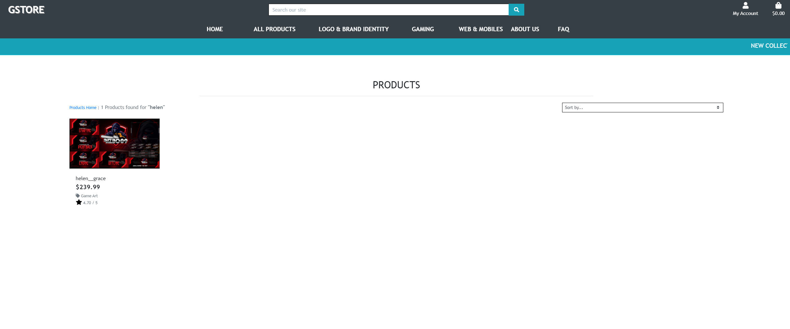
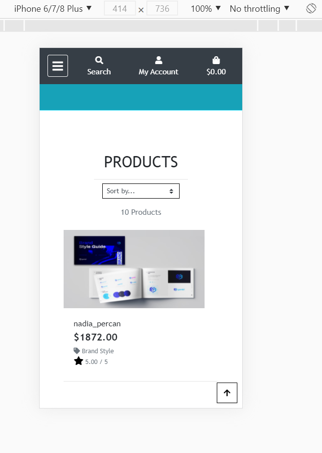
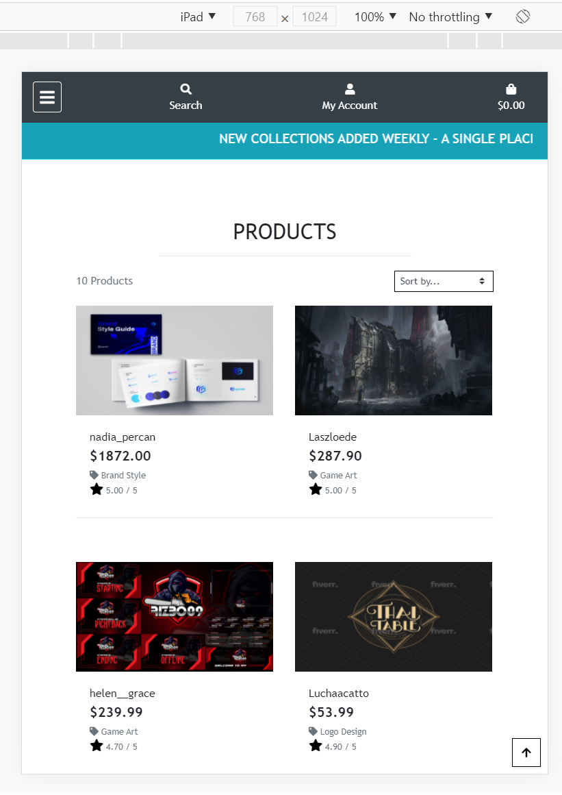
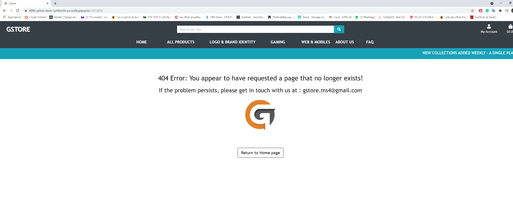

# Testing

## Testing user stories
### Testing for Customers
- Viewing and Navigation -- OK
    -   Users can see all products in Gstore. 
    -   Users can see selected products in bag.
    -   Users can see information about the web site.
    -   Users can see a list of questions and answers relating to a particular subject.
- Registration and User Accounts -- OK
    -   Users are able to register, log in, log out their account. 
    -   Users can view and edit their profile after log in.
    -   Users can reset or recover account password.

- Sorting and Searching -- OK
    -   Products can be sorted by category, name, price or rating
    -   Users can filter products.
    -   Users can make quick search with the search bar.
- Other testing :
    -   Users receive a post email confirmation about their order -- OK
    -   Users can add/remove or edit products in my bag -- OK
    -   Users are able to leave their reviews and see others reviews about the product -- OK
    -   Log in is require to leave reviews -- OK

### Testing for Shop Administrators
- Add/Edit/Update product listing when necessary -- OK
- Delete products -- OK
- View and Remove users reviews -- OK

## Navigation

-   The navigation link works as expected, each dropdown links to intended page
-   Verify hover effects are present on all nav links
-   All the account functionalities work as intended such as register and login
-   Login and register links remove once a user is logged into the site
-   The shopping bag populates all expected details and updates accordingly
-   The navbar is responsive on mobile devices
-   Admin/superuser specific links appear in 'My Account' dropdown as intended

### Search Bar

-   The search bar functions efficiently to help users narrow down their search criteria with a particular keyword.
 

## Homepage

### Hero Image

-   The Hero image and colors load as intended on all device size.
-   First time user would assimilate the front page caption with various and clear options of navigation bar.
-   A message box under the navigation is moving continuously from right to left every time the site is ready.

## Product Listing

-   The product listing section populates all products accordingly.
-   The selection form for sorting works properly and users can sort products by Category, Name, Price, and Rating in descending or descending order.
-   Users can quickly get back to the top with a "Back to Top" button.
-   Clicking a particular product will expand detailed information as expected.

## Product Details

-   The product detail page populates comprehensive data set about a particular product.
-   The size adjustment selection form functions properly
-   The Add to bag and Keep Shopping buttons link to correct pages.
-   Review details populates at the bottom page as expected.

## Profile

-   The page loads responsively on all device sizes.
-   The profile page populates users data accordingly and the already saved information can be updated.
-   The correct order history is displayed accordingly.
-   The "update information" button works properly.
-   Clicking on the order number populates a comprehensive summary about the order.

## Shopping Bag

- All links/buttons work as expected :
Keep Shopping, Add to bag, Product Image (opens in new tab - large), Product quantity buttons (not able to reduce the quantity to below 1), Edit product button (visible to admin/superuser only), Delete product button (visible to admin/superuser only) 

## Checkout and Payment

-   Webhooks was tested with post feedback success.
-   Stripe payment functionalities work accordingly
-   The checkout form loads properly.
-   The checkout form populates the saved pre-filled profile as expected.
-   The order summary details are properly displayed.
-   Checkout information can be saved to profile when checkbox is selected.
-   Upon payment users will receive a post email confirmation about their orders 
-   Unsuccessful payment returns feedback accordingly.

## Review

-   The review form works as expected, only register user can write reviews.
-   The time updated as the device time.

## FAQ Page

-   Color box is displayed as intended
-   All question box are clickable and show the respective answer as expected

## About page

-  Images and texts is displayed as expected.

## Subscribe

-  Used Code Institute templates

## Administrative Features

-   Links to product management in the navigation can only be seen if a user is logged in as an administrator.

### Product Management

-  It works as intended, only admin account can add/edit/delete

### Adding a Product

-   All required fields must be filled to add a new product as intended.

### Editing/Deleting a Product

-  Work as expected for admin account or superuser.

## Responsiveness

### Further Testing
* Error pages such as 404 and 500 are shown as expected
* All links were tested. Internal links all work. External links all work and open in new window.
* The Website was tested on Google Chrome, Internet Explorer, Firefox, Microsoft Edge and Safari browsers.
* The website was test run on a variety of devices such as Desktop, Laptop, iPhoneXR, Samsung Note3, Samsung Tab2 & Nokia.
* All the pages are responsive on all screen sizes.
* All Codes passed through their respective Validators to erase syntax error.
* Footer styled is as I wanted it to be.
 
 
 

## Bugs

### Known issues
* Httml error - Element marquee not allowed as child of element div in this context. I've tried to put inside the tag dl then dd then dt but it gives the same error so I just keep it inside my div to make sure it has the style I want.
* Httml error - The center element is obsolete.     

### Fixed

* The static file is not update automatically, I have to reinstall the latest update to AWS.
* Overflow in horizontal due to bootstrap row, I have to remove some prebuilt style.
* Button back to top is not well displayed in footer because of its dark color, I have to change to the light color but still keeping the web consistency.
* Fixed duplicated ID, some ID are duplicated because there are another html page for mobile. I have to change the one on mobile to *-mobile to distinguish.